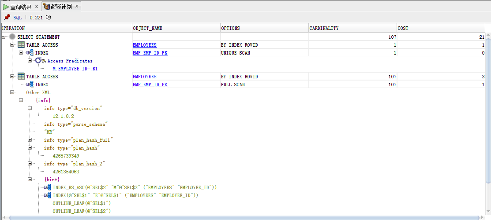
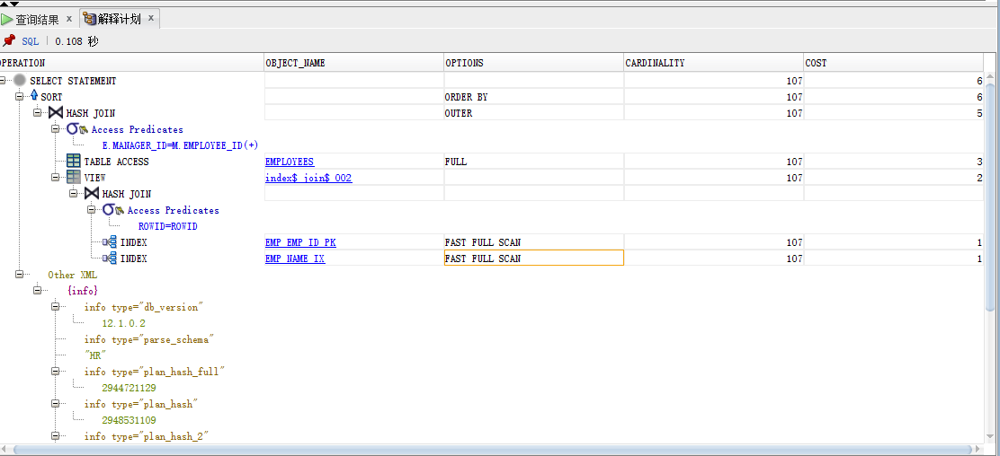
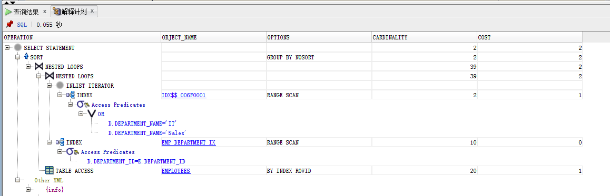
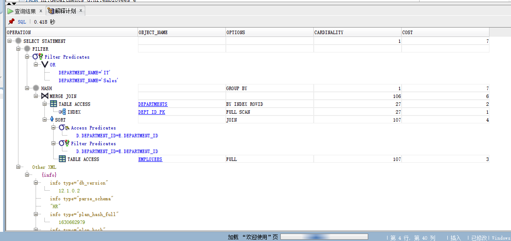
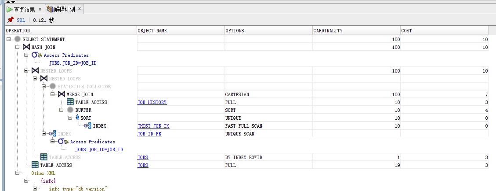
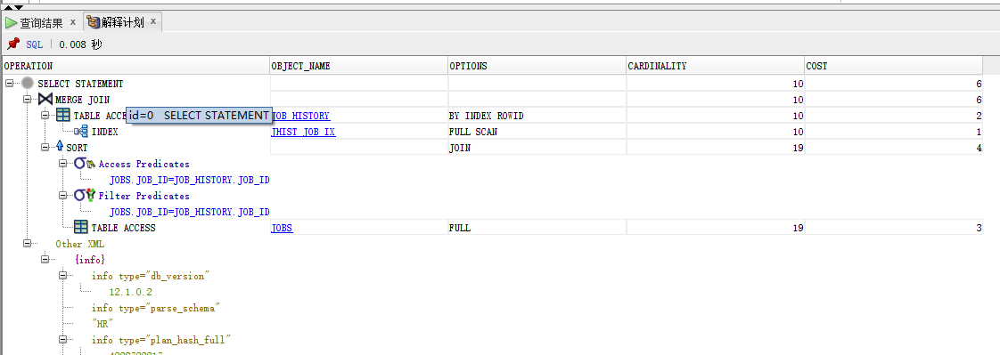

# 实验一
## 分析oracle12c教材上的查询语句
- 语句一：
```
SELECT e.EMPLOYEE_ID,e.FIRST_NAME,e.MANAGER_ID,
(SELECT M.FIRST_NAME FROM employees m 
WHERE m.EMPLOYEE_ID=e.MANAGER_ID)
AS MANAGER_NAME FROM hr.employees e ORDER BY e.EMPLOYEE_ID;
``` 



分析：
语句一先执行子查询，这里是一个主键唯一性索引。消耗1个cpu资源.
然后执行主查询语句，这里是一个全表扫描。消耗4个cpu资源
总查询一共消耗21个cpu资源

    

- 语句二：

```
SELECT e.EMPLOYEE_ID,e.FIRST_NAME,e.MANAGER_ID,m.FIRSTNAME
AS MANAGER_NAME FROM employees e,employees m WHERE
e.MANAGER_ID=m.EMPLOYEE_ID(+)ORDER BY e.EMPLOYEEE_ID;
```



分析：  
语句二是先做的查询，快速索引查询出别名为e和m的要查询的信息。消耗2个cpu资源
然后做右外连接，全表扫描，消耗5个cpu资源
总语句一共消耗6个cpu资源。此表做的是hash join的连接方式。  
hash join：  
Hash join散列连接是CBO 做大数据集连接时的常用方式，优化器使
用两个表中较小的表（通常是小一点的那个表或数据源）利用连接键（JOIN KEY）在
内存中建立散列表，将列数据存储到hash列表中，然后扫描较大的表，同样对JOIN KE
Y进行HASH后探测散列表，找出与散列表匹配的行。需要注意的是：如果HASH表太大，无
法一次构造在内存中，则分成若干个partition，写入磁盘的temporary segment，则会多
一个写的代价，会降低效率。


**对比**：  
语句二的执行使用了hash join连接，而语句一只用了单纯的索引。在消耗cpu资源上，语句一很耗cpu。
语句二是比语句一更好的查询语句
## 给出的实验语句分析

- 语句一：

```
SELECT d.department_name，count(e.job_id)as "部门总人数"，
   avg(e.salary)as "平均工资"
   from hr.departments d，hr.employees e
   where d.department_id = e.department_id
   and d.department_name in ('IT'，'Sales')
   GROUP BY department_name;
```


分析：


分析：该语句先执行查找出部门为IT,和Sales的语句耗费一个cpu资源。
然后做别名为D，E连个表的连接，不消耗cpu。表的连接方式为nested loop
nested loop：  
从A表抽一条记录，遍历B表查找匹配记录，然后从a表抽下一条，遍历B表，就是一个二重循环。  
nested loop复杂度：  
如果内层循环t2走的是全表扫描，复杂度是O(m*n)；
如果内层循环t2走的是索引扫描，复杂度是O(m*log(n))；

全表总消耗为2个cpu资源

- 语句二：
```
SELECT d.department_name，count(e.job_id)as "部门总人数"，
avg(e.salary)as "平均工资"
FROM hr.departments d，hr.employees e
WHERE d.department_id = e.department_id
GROUP BY department_name
HAVING d.department_name in ('IT'，'Sales');
```


分析：
语句二是先做的查询，快速索引查询出别名为d和e的要查询的信息。消耗3个cpu资源
然后做连接，全表扫描，消耗3个cpu资源
总语句一共消耗7个cpu资源。
此表的连接方式为Merge Join。  
Merge Join：  
是先将关联表的关联列各自做排序，然后从各自的排序表中抽取数据，到另一个排序表中做匹配。
因为merge join需要做更多的排序，所以消耗的资源更多。

**对比**：  
使用Merge Join这种连接比nested loop这种连接。更消耗cpu的资源利用率。总的来说第一中查询方法是比较好的
## 自定义语句

- 语句一：  
```$xslt
select * from jobs,job_history where 
jobs.JOB_ID in (select JOB_ID from job_history)
```


- 语句二：  
```$xslt
select * from jobs,job_history where 
jobs.job_id = job_history.job_id;
```
