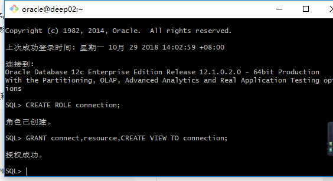
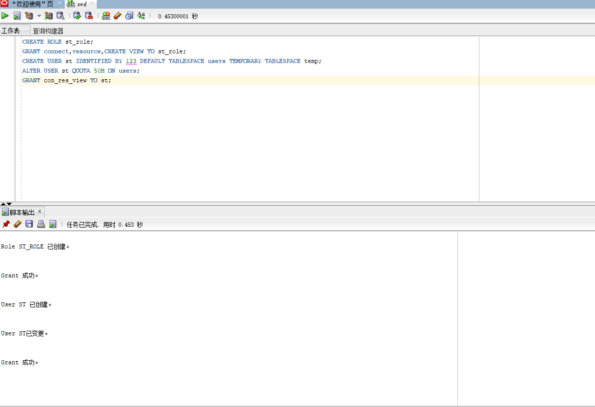
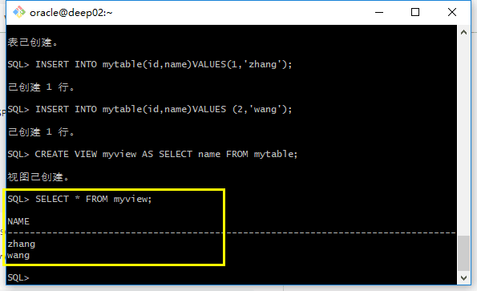
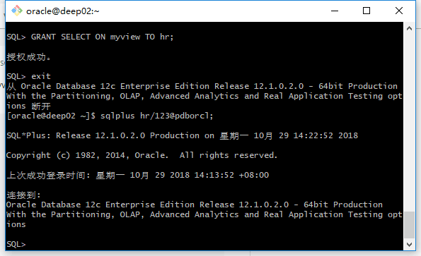
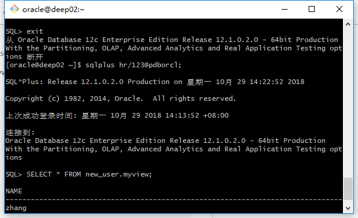

# 实验2：用户管理 - 掌握管理角色，权根，用户的能力，并在用户之间共享对象。

## 第一步:
- CREATE ROLE connection;  
以system用户登陆，执行CREATE ROLE connection;生成了一个connection角色。  
- GRANT connect,resource,CREATE VIEW TO connection;  
授权连接，和resource，和创建视图的权力给connection角色  

- CREATE USER new_user_liujun IDENTIFIED BY 123 DEFAULT TABLESPACE users TEMPORARY TABLESPACE temp;  

***此时new_user_liujun用户具有连接，查询，创建表、过程、触发器、视图等功能；***

## 第二步：
- sqlplus new_user_liujun/123@pdborcl  
以new_user_liujun的身份登录pdborcl

- CREATE TABLE mytable (id number,name varchar(50));  
创建一张名为mytable的表，有number型的id字段，和长度为50的varchar类型的name字段

- INSERT INTO mytable(id,name)VALUES(1,'zhang');  
- INSERT INTO mytable(id,name)VALUES (2,'wang');  
以上两步是插入两条数据

- CREATE VIEW myview AS SELECT name FROM mytable;  
创建名为myview的视图，内容是查询所有name从mytable
- GRANT SELECT ON myview TO hr;  
把select权限授予hr用户

## 第三步：
- sqlplus hr/123@pdborcl  
以hr用户登录
- SELECT * FROM new_user.myview  
查询st用户创建的myview视图

