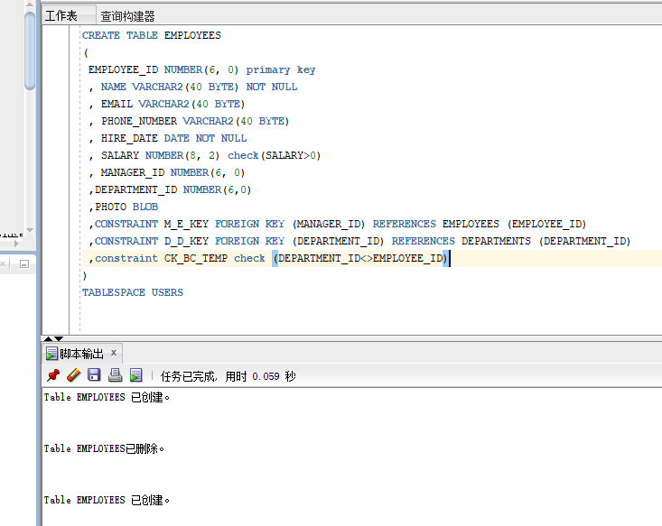

# 实验4：对象管理

# 一创建表：  
- EMPLOYEES表：  
```aidl
CREATE TABLE EMPLOYEES 
(
 EMPLOYEE_ID NUMBER(6, 0) primary key 
 , NAME VARCHAR2(40 BYTE) NOT NULL
 , EMAIL VARCHAR2(40 BYTE)  
 , PHONE_NUMBER VARCHAR2(40 BYTE) 
 , HIRE_DATE DATE NOT NULL 
 , SALARY NUMBER(8, 2) check(SALARY>0) 
 , MANAGER_ID NUMBER(6, 0) 
 ,DEPARTMENT_ID NUMBER(6,0) 
 ,PHOTO BLOB
 ,CONSTRAINT M_E_KEY FOREIGN KEY (MANAGER_ID) REFERENCES EMPLOYEES (EMPLOYEE_ID)
 ,CONSTRAINT D_D_KEY FOREIGN KEY (DEPARTMENT_ID) REFERENCES DEPARTMENTS (DEPARTMENT_ID)
 ,constraint CK_BC_TEMP check (DEPARTMENT_ID<>EMPLOYEE_ID)
) 
TABLESPACE USERS 
```  
  
employees表的name列的不唯一索引：  
```aidl
create UNIQUE INDEX EMPLOYEE_NAME ON EMPLOYEES (NAME ASC);
```   

- DEPARTMENTS表： 
```aidl
CREATE TABLE DEPARTMENTS 
(
 DEPARTMENT_ID NUMBER(6, 0) primary key 
 , DEPARTMENT_NAME VARCHAR2(40 BYTE) NOT NULL
) 
TABLESPACE USERS
```
 - PRODUCTS表：
 ```aidl
CREATE TABLE DEPARTMENTS 
(
 PRODUCT_NAME VARCHAR2(40 BYTE) primary key 
 , PRODUCT_TYPE VARCHAR2(40 BYTE) NOT NULL check(PRODUCT_TYPE in('耗材','手机','电脑'))
) 
TABLESPACE USERS 
```  
- orders表：  
```aidl
CREATE TABLE ORDERS 
(
 ORDER_ID NUMBER(10, 0) primary key 
 , CUSTOMER_NAME VARCHAR2(40 BYTE) NOT NULL
 , CUSTOMER_TEL VARCHAR2(40 BYTE)  NOT NULL
 , ORDER_DATE DATE NOT NULL 
 , EMPLOYEE_ID NUMBER(6, 0) NOT NULL
 , DISCOUNT NUMBER(8, 2) 
 ,TRADE_RECEIVABLE NUMBER(8,2) default 0
 ,constraint E_key FOREIGN KEY (EMPLOYEE_ID) REFERENCES EMPLOYEES (EMPLOYEE_ID)
) 
TABLESPACE USERS02
PARTITION BY RANGE (ORDER_DATE) 
(
 PARTITION PARTITION_BEFORE_2015 VALUES LESS THAN (
 TO_DATE(' 2015-01-01 00:00:00', 'SYYYY-MM-DD HH24:MI:SS', 
 'NLS_CALENDAR=GREGORIAN')) NOLOGGING  TABLESPACE USERS  
);
```   
oeders表创建序列：  
````aidl
CREATE SEQUENCE SEQ_ORDER_ID 
INCREMENT BY 1
START WITH 1;
````
- ORDER_DETAILS表:  
```aidl
CREATE TABLE ORDER_DETAILS 
(
 ID NUMBER(10, 0) primary key 
 , ORDER_ID  NUMBER(10, 0) NOT NULL
 , PRODUCT_NAME VARCHAR2(40 BYTE)  NOT NULL
 , PRODUCT_NUM NUMBER(8, 2) NOT NULL 
 ,PRODUCT_PRICE NUMBER(8, 2) NOT NULL 
 ,constraint order_details_fk1 FOREIGN KEY (ORDER_ID) REFERENCES ORDERS (ORDER_ID)
) 
PARTITION BY REFERENCE (order_details_fk1);
```  
ORDER_DETAILS表的序列  
```aidl
CREATE SEQUENCE SEQ_ORDER_DETAILS_ID 
INCREMENT BY 1
START WITH 1;
```

